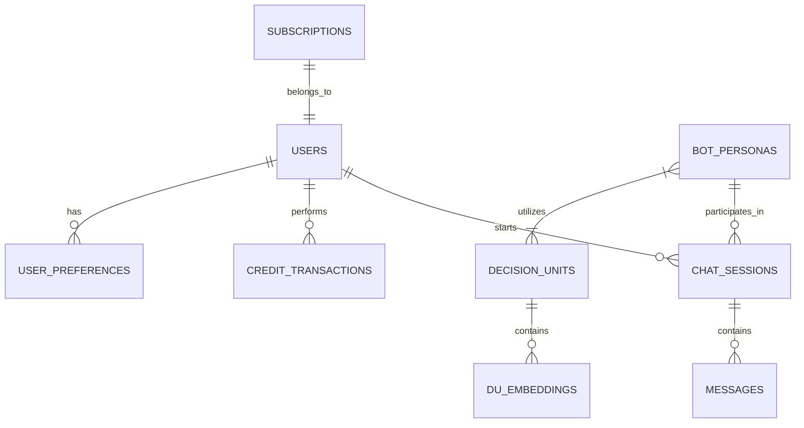

# AICEO Database Architecture

This document outlines the **mandatory database architecture** required to support the AICEO SaaS platform. It is designed to be scalable, secure, and optimized for an AI-driven application.

## 🏗 High-Level Schema (ER Diagram)

## 🗄 Core Tables

### 1. Identity & Auth (`users`)
Stores user credentials, profile information, and current status.

| Column | Type | Description |
| :--- | :--- | :--- |
| `id` | UUID (PK) | Unique identifier for the user. |
| `email` | VARCHAR | User's email address (Unique). |
| `password_hash` | VARCHAR | Encrypted password (bcrypt/argon2). |
| `full_name` | VARCHAR | Display name. |
| `avatar_url` | VARCHAR | URL to profile picture. |
| `role` | ENUM | `'user'`, `'admin'`, `'super_admin'`. |
| `created_at` | TIMESTAMP | Account creation date. |
| `is_active` | BOOLEAN | Soft delete / ban flag. |

### 2. Billing & Credits (`wallets` & `transactions`)
Manages the platform's currency. Critical for the pay-per-use model.

**`wallets`**
| Column | Type | Description |
| :--- | :--- | :--- |
| `user_id` | UUID (FK) | Link to `users`. |
| `balance` | DECIMAL | Current credit balance (high precision). |
| `tier` | VARCHAR | e.g., 'Free', 'Pro', 'Enterprise'. |

**`credit_transactions`**
| Column | Type | Description |
| :--- | :--- | :--- |
| `id` | UUID (PK) | Transaction ID. |
| `user_id` | UUID (FK) | Who spent/gained credits. |
| `amount` | DECIMAL | Negative for spend, positive for purchase. |
| `type` | ENUM | `'chat_burn'`, `'top_up'`, `'bonus'`, `'fine'`. |
| `reference_id` | UART | ID of the related chat/invoice (optional). |
| `timestamp` | TIMESTAMP | When the transaction occurred. |

### 3. AI Personas (`bot_personas`)
Defines the available AI experts (e.g., "Logistics Strategy", "Algorithm Master").

| Column | Type | Description |
| :--- | :--- | :--- |
| `id` | UUID (PK) | Unique identifier. |
| `name` | VARCHAR | Display name (e.g., "Adrian Firnanda"). |
| `role_title` | VARCHAR | Short role (e.g., "TikTok Expert"). |
| `system_prompt` | TEXT | The core instruction set for the LLM. |
| `model_config` | JSONB | Settings like `{ "temp": 0.7, "model": "gpt-4" }`. |
| `icon_url` | VARCHAR | URL to the bot's avatar. |
| `is_public` | BOOLEAN | Whether all users can see this bot. |

### 4. Decision Units (`decision_units`)
The "brains" or knowledge bases. Often linked to vector databases.

| Column | Type | Description |
| :--- | :--- | :--- |
| `id` | UUID (PK) | Unique identifier. |
| `name` | VARCHAR | e.g., "Margin Low Strategy". |
| `description` | TEXT | User-facing description. |
| `vector_collection_id`| VARCHAR | Reference to the Vector DB collection (Pinecone/Weaviate). |
| `file_source` | VARCHAR | Origin file (PDF/CSV) path. |
| `status` | ENUM | `'processing'`, `'active'`, `'error'`. |

### 5. Chat History (`chat_sessions` & `messages`)
Stores the actual interactions.

**`chat_sessions`**
| Column | Type | Description |
| :--- | :--- | :--- |
| `id` | UUID (PK) | Unique session ID. |
| `user_id` | UUID (FK) | The user. |
| `bot_id` | UUID (FK) | The persona being chatted with. |
| `title` | VARCHAR | Auto-generated conversation title. |
| `is_favorite` | BOOLEAN | Starred status. |
| `last_active` | TIMESTAMP | For sorting recent chats. |

**`messages`**
| Column | Type | Description |
| :--- | :--- | :--- |
| `id` | UUID (PK) | Message ID. |
| `session_id` | UUID (FK) | Link to the chat session. |
| `sender` | ENUM | `'user'`, `'bot'`, `'system'`. |
| `content` | TEXT | The message body. |
| `tokens_used` | INTEGER | Cost calculation metric. |
| `created_at` | TIMESTAMP | Message timestamp. |

## 📦 Non-Relational Stores (NoSQL/Vector)

In addition to the SQL schema, the following are **mandatory** for this architecture:

1.  **Vector Database (Pinecone / Weaviate / Milvus)**
    *   Required for RAG (Retrieval Augmented Generation).
    *   Stores embeddings of the `decision_units` data to allow bots to "read" the strategy documents.

2.  **Redis (Cache)**
    *   **Rate Limiting**: Prevent API abuse.
    *   **Session State**: Store temporary chat context for speed.
    *   **Pub/Sub**: For real-time token streaming to the frontend.

## 🔒 Security Requirements

1.  **Row Level Security (RLS)**: Ensure users can ONLY access their own chats and transactions.
2.  **Encryption At Rest**: Especially for `system_prompt` (IP protection) and user PII.
3.  **Audit Logs**: Trigger-based logging for any changes to `wallets` or `admin` actions.
